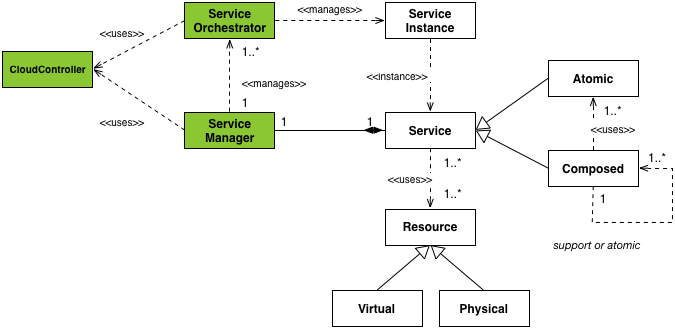

# Hurtle Architecture

Hurtle follows the principles of services oriented architectures and its architecture is divided into a number of services. 

Before delving in the components themselves, it is important to understand the different actors involved in the writing and usage of a hurtle-managed service as well as the lifecycle of a hurtle service described in the main README.

## Actors
The Service Developer or Enterprise End User (EEU) designs the service which will be offered and writes the necessary components to integrate with the Hurtle framework.

The End User (EU) is the one actually requesting an instance of a service for his own uses.

<!--## Service Lifecycle

The technical phase (see below diagram) includes essentially all activities from technical design all the way through to technical disposal of a service.
 


* **Design**: Design of the architecture, implementation, deployment, provisioning and operation solutions.
* **Implementation**: of the designed architecture, functions, interfaces, controllers, APIs, etc.
* **Deployment**: Deployment of the implemented elements, e.g. DCs, cloud, controllers, etc. Provide anything such that the service can be used, but don't provide access to the service. Examples include: 
	* Placing a VM image (optional: may already exist) on the IaaS provider and create an instance from it.
	* Installing machines (based on VM images, on penguins or whatever that is. So, providing anything preparing the usage of the service.
* **Provisioning**: Provisioning of the service environment (e.g. NFs, interfaces, network, etc.). Activation of the service such that the user can actually use it. Examples:
	* Installing services, e.g., Apache HTTP server (optional, may already be installed), configure it and activate it. Typically, configuration management frameworks, like Puppet , Chef  and CFEngine  are used here.
	* Bringing in policies and whatever is needed to make the service run.
* **Operation and Run-Time Management**: in this stage the service instance is ready and running. Activities such as scaling, reconfiguration of Service Instance Components (SICs) are carried out here.
* **Disposal**: Release of SICs and the service instance itself is carried out here.

-->
## Architecture components

All the components are represented in the diagram below.

The following three sections explain the essential parts of the diagram in more details:

### Service Manager

The SM provides an external interface to the EEU and is responsible for managing service orchestrators. It takes part in the Design, Deployment, Provisioning, Operation & Runtime Management and Disposal steps in the Technical Lifecycle of the Service.

### Service Orchestrator
The Service Orchestrator (SO) is a key element in Hurtle: it oversees the end-to-end orchestration of a service instance. It is responsible for managing the Service Instance and in particular its components (SIC), once it is created and running. Each Service Instance is managed by a SO. It is therefore a domain specific component as it has all the business specific logic encoded within it. This is further described in Figure 10. MCN entities, identifying the deliverables where they are presented 
The SO plays a large role in the 'Runtime & Management' step of the MCN Service Lifecycle. In particular, it is responsible of SIC instantiation and configuration, triggering of scaling and migration of SICs according to data collected e.g. from Support Services like MaaS (see sec. 4.3.4) and disposal of SICs. 

### Cloud Controller

### Service Instance

