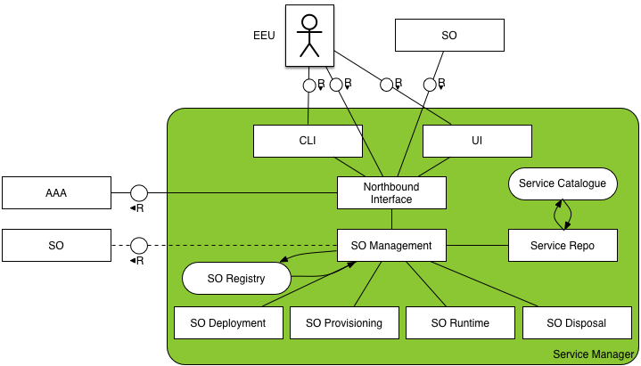
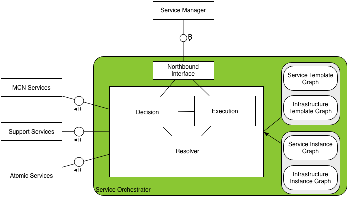
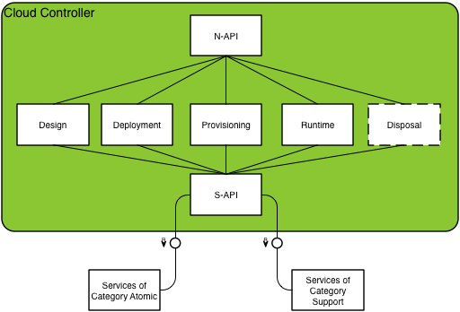

# Hurtle Conceptual Architecture

Hurtle follows the principles of services oriented architectures and its architecture is divided into a number of services. 

Before delving in the components themselves, it is important to understand the different actors involved in the writing and usage of a hurtle-managed service as well as the lifecycle of a hurtle service described in the main README.

## Actors

1. The Service Developer designs the service which will be offered and writes the necessary components to integrate with the Hurtle framework.

2. The End User (EU) is the one actually requesting an instance of a service for his own uses.

-->
## Architecture components

All the key components of hurtle are represented in the diagram below.

Hurtle's fundamental idea is that what is offered to the end user is a *service*. 

This service can be then accessed by the end user, allowing him to create a *service instance* of their own, entirely owned and controlled by him. The service that the end user instantiates can be one that is made up of other services, a *composed service*, or not, an *atomic service*.

The services themselves are powered and underpinned by *resources*, which can be *virtual* or *physical*. Examples of virtual resources include virtual machines, virtual hard drives and virtual networks. Examples of physical resources include a physical server, a network switch and a storage server.

In order to get a service instance, the end user requests it through the *service manager*. When the service manager receives the request its key function is to create a *service orchestrator* that is responsible for the creation of the resources and software supporting the creation of the service instance following the Hurtle service lifecycle. The service manager and service orchestrator uses the *Cloud Controller* as an abstraction layer to access various services and resources to found the service instance.

The following three sections explain the essential parts of the architecture, service manager, service orchestrator and cloud controller, in more details:

### Service Manager

The SM provides an external interface to the EEU and is responsible for managing service orchestrators. It takes part in the Design, Deployment, Provisioning, Operation & Runtime Management and Disposal steps in the Technical Lifecycle of the Service.

The SM’s programmatic interface (northbound interface, NBI) is designed so it can provide either a CLI and/or a UI. Through the NBI, the SM gives the EEU or SO, both classed as tenant, capabilities to create, list, detail, update and delete (EEU) tenant service instance(s). 

The “Service Catalogue” contains a list of the available services offered by the provider. 

The “Service Repository” is the component that provides the functionality to access the “Service Catalogue”. 

### Service Orchestrator

A Service Orchestrator (SO) is also a key element in Hurtle: it oversees the end-to-end orchestration of a service instance. It is responsible for managing the Service Instance and in particular its components (SIC), once it is created and running.

Each Service Instance is managed by a SO. It is therefore a domain specific component as it has all the service specific logic encoded within it. 

The SO plays a large role in the 'Runtime & Management' step of the Service Lifecycle. In particular, it is responsible for the triggering of scaling and migration of SICs according to data collected e.g. from the Monasca notification service.

### Cloud Controller

The Cloud Controller is a logical entity consisting of multiple modules that abstract underlying technology choices. It is used by both Service Managers and Service Orchestrators to issue requests to the underlying infrastructure.

It provides extensible interfaces and currently is used to support multiple technologies such as OpenShift and OpenStack. 

